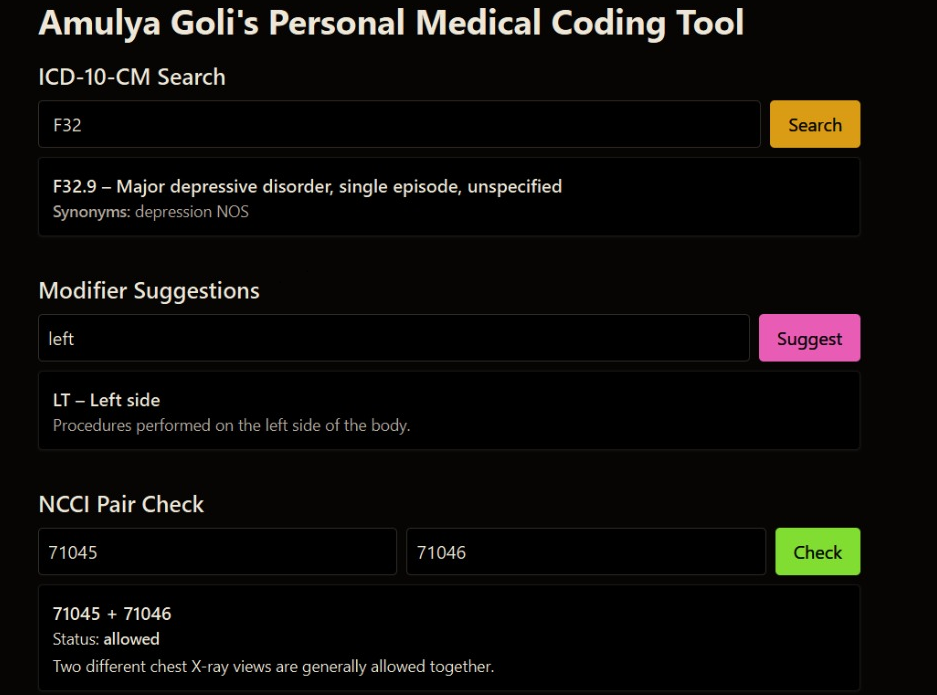

<!--
  Amulya Goli • High-End Animated GitHub Profile README
  Tip: keep the /assets folder at the repo root and upload:
       - /assets/ammu.png
       - /assets/MCT.jpg
       - /assets/portfolio.png
-->

  

  <!-- Subtle animated banner (SVG gradient + shimmer) -->
  

 

  

<h2 align="center">CPC-certified • Medical Coding & Claims • Revenue Integrity</h2>

  Transforming clinical documentation into precise, compliant claims — and building elegant tools to reduce edits, denials, and rework.

  
  
  
  

---

### 💡 What I Do
- **Medical Coding:** CPT • ICD-10-CM • HCPCS • Modifiers • NCCI/MUE • LCD/NCD  
- **Claims & Denials:** root-cause analysis, successful appeals, payer rule compliance  
- **Revenue Cycle Analytics:** KPI/denial trends, charge capture, reconciliation  
- **RCM Systems:** Epic, Cerner, IDX, Centricity, payer portals  
- **Tooling:** I build small, sharp tools that catch issues **before** submission

> Mission: **Fewer edits. Fewer denials. Faster, clean claims.**

---

## ✨ Featured Project — Medical Coding Tool
Proof-of-concept assistant for ICD-10-CM lookup, **modifier guidance**, and **NCCI/MUE checks** to stop bad claims early.

  

**Highlights**
- Keyboard-fast ICD-10 search with synonyms/context
- Modifier helper + MUE awareness
- Roadmap: CMS-1500 builder, LCD/NCD integration, payer-specific rules

**Live Demo:** https://medical-coding-tool.vercel.app/

---

## 🧰 Skills & Toolbelt

  
  
  
  
  
  
  
  
  
  

---

## 🗂 Experience (snapshot)
- **Claims Follow-up Associate — IKS Health (2024–present):** Manage high-volume A/R, fix payer edits/denials, run KPI & trend reports, drive appeals, ensure CMS/HIPAA compliance.  
- **Medical Coder & Biller — Optum (2021–2022):** ICD-10-CM/CPT/HCPCS coding (IP/OP), resolve edits, support reconciliation & audit-ready summaries, work across Epic/Cerner.

---

## 🏆 Achievements & Stats

  

  
  

  

---

## 🧭 Quick Links
- 🔗 **Portfolio:** <a href="https://amulyagoli.github.io/Portfolio/">amulyagoli.github.io/Portfolio/</a>  
- 🧪 **Live Demo (MCT):** <a href="https://medical-coding-tool.vercel.app/">medical-coding-tool.vercel.app</a>  
- 📄 **Resume:** <a href="assets/Amulya_goli_resume.pdf">PDF</a>

---

  
<b>Behind the Design (motion & polish)</b>

- Animated banner (SVG) + typing headline to create a premium first impression  
- Trophy + stats cards for social proof and momentum  
- Project spotlight with hero image (drag your own file to <code>/assets</code> and update the path)  
- Badges = fast “at-a-glance” expertise (CPT/ICD-10-CM/HCPCS/NCCI…)  
- Everything is mobile-friendly and dark-mode-happy ✨

---

  
    
  <i>“Fewer edits. Fewer denials. Faster payments.”</i>

